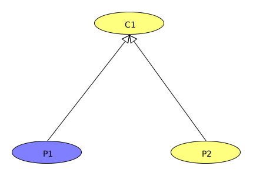
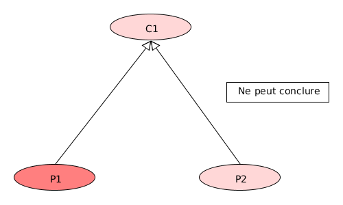
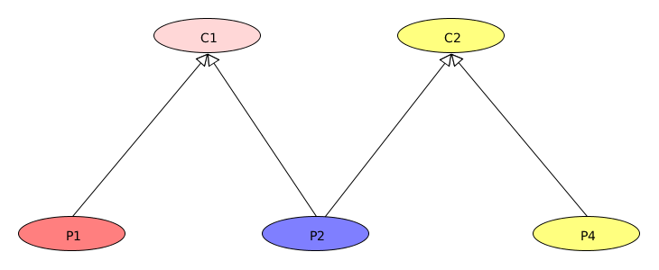
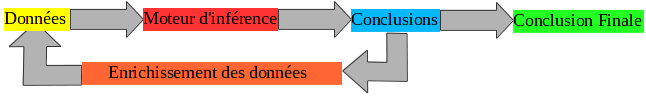

name: groupe
class: middle, center

# Systèmes Experts

* Yohan Rordiguez
* Damien Gabrielle
* Alexandre Ramel
* Bastien Chevriaut
* Thomas Loubiou
* Enzo Sandre

---

# Sommaire

* Introduction
* Base de connaissances
* Chaînage arrière
* Chaînage avant
* Idée d’amélioration
* Conclusion

---

# Introduction

* Un système expert est un logiciel informatique permettant de simuler l’inférence logique, en implémentant les mécanismes d’induction et de déduction.

* Un système expert se définit par : 
   * Une base de faits, 
   * Une base de règles, 
   * Un moteur d’inférence

---

# Base de connaissances

* Logiques et connaissances "métier" d'un domaine spécifique
    * base de faits
    * base de règles

---

# Chaînage arrière

* Induction logique
* Recherche de questions à poser à l’utilisateur

---

class: center
# Amélioration chaînage arrière

---

class: center
# Amélioration chaînage arrière

---

class: center
# Amélioration chaînage arrière

---

class: center
# Chaînage avant

---

# Idée d’amélioration

* Appliquer une logique floue (utilisation de nombres réels) 
 * Prioriser les questions à poser
* Apprentissage supervisé

---
class: center, middle
# Conclusion

# Merci de votre attention
